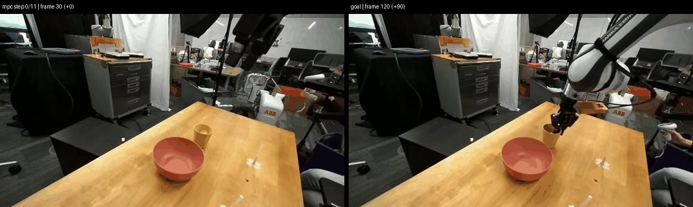
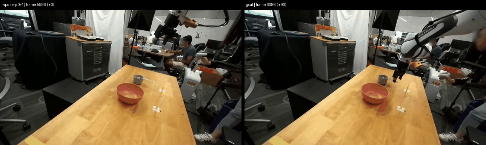
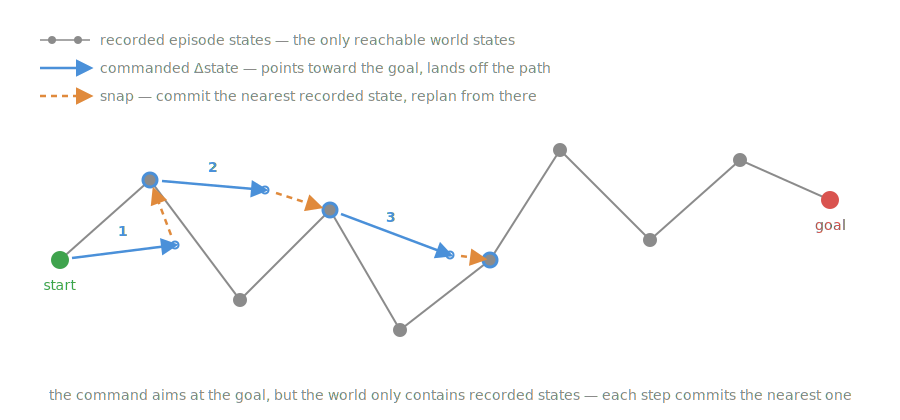

# vjepa-ac

[繁體中文](README-TW.md)

A small-scale reproduction of Meta's **V-JEPA 2-AC** for learning and
experimentation. It predicts how a robot's camera view will change after a
motion, then uses those predictions to plan toward a goal image.

The original model uses about 62 hours of robot data and a 300M-parameter
predictor. This project uses the first 100 successful episodes from
`nvidia/Cosmos3-DROID` (about 45 minutes) and trains roughly 24M parameters in
a few GPU-hours. Tests and smoke runs work locally on CPU; full runs use a
remote GPU machine.

## Outcome

Directly predicting V-JEPA's full image features did not work at this scale:
the model mostly ignored robot motion. The final design first compresses each
frame into 16 motion-aware tokens and predicts in that smaller space.

| Held-out result | Raw features | Final model |
| --- | ---: | ---: |
| Error increase after shuffling actions | +0.2% | +50-65% at horizon 15 |
| Model error / repeat-input-frame error | about 1.0 | 0.67-0.73 |
| Retrieved-frame timing | stayed at input | tracks the true frame |

Shuffled actions should hurt because the future depends on the action. The
large increase therefore shows that the final model uses motion information.
A model/copy ratio below 1 means it predicts better than simply repeating the
input frame.

Goal-image planning on held-out episodes (left: selected frames; right: goal):






## Why the design changed

Three measurements explain the change from the paper's full-feature target:

1. **The raw-feature model ignored actions.** Shuffling actions changed error
   by only 0.2%, zero actions behaved similarly, and predicted rollouts stayed
   near the input frame.
2. **The encoder still contained motion information.** A 23M-parameter probe
   decoded motion from pairs of encoded frames with R2 around 0.37.
3. **Actions alone could not explain raw feature changes.** Ridge regression
   explained 0.00% of raw latent-delta energy across scenes. Learning the
   required action-and-scene interaction would need more data and training.

The practical fix is a learned compressor trained with inverse dynamics: from
two consecutive token sets, an auxiliary head must recover the robot motion.
This makes motion visible in the prediction target instead of letting image
content dominate the loss.

Two other choices came from measurements:

- Frames use stride 6 because motion at the original 15 Hz was below encoder
  noise.
- Conditioning uses the robot motion that actually occurred, with angle wrap
  correction, rather than the requested command.

## System design

`frozen V-JEPA encoder -> motion-aware compressor -> causal predictor -> CEM planner`

- **Encoder:** `facebook/vjepa2-vitl-fpc64-256` converts a 256x256 frame into
  256 x 1024 patch features. Frames are encoded once and cached; the encoder
  is not trained.
- **Compressor (~7M parameters):** 16 learned queries attend to the 256 patches
  and produce 16 x 384 tokens. An inverse-dynamics head makes the tokens retain
  motion; a light reconstruction loss preserves scene information.
- **Predictor (~17M parameters):** a 6-layer block-causal transformer predicts
  the next token change from up to 16 frames and their actions:
  `z[t+1] = z[t] + f(z[<=t], a[<=t])`.
- **Action input (7 values):** summed, angle-corrected state change for robot
  dimensions 0-5 and absolute gripper state for dimension 6. Training-set
  normalization values are stored with the checkpoint.

### Training

Training has two stages so expensive predictor training starts only after the
compressed space passes basic checks.

1. `train_compressor.py` trains the compressor, inverse-dynamics head, and
   temporary reconstruction decoder. Continue only if held-out motion R2 is at
   least 0.2 and the compressed-space linear ceiling is at least +2%.
2. `train.py` fine-tunes the compressor at a low learning rate while training
   the predictor. Its loss combines next-token prediction, a two-pass rollout,
   and inverse dynamics. Stop-gradient targets and motion monitoring guard
   against token collapse.

The main recipe uses 16 frames at stride 6, spanning 91 source frames, with an
episode-level train/validation split and batch size 64 via gradient
accumulation.

### Planning demo

`plan_demo.py` demonstrates model-predictive control (MPC) without a live
robot. At every step it:

1. samples 8-step action sequences with CEM;
2. predicts their outcomes and chooses the sequence ending closest to the goal
   tokens;
3. executes only the first few actions, adds them to the recorded robot state,
   and selects the recorded frame with the nearest state;
4. adds that real frame and its actual motion to the context, then plans again.



The recorded episode acts as a simple environment, not as proof of real-robot
control. Execution never uses the goal frame's time index or assumes that the
next frame is later in the recording. This prevents a future goal from being
reached automatically.

Useful controls:

- `--commit-steps` combines 2-3 actions when one action is too small to reach a
  different recorded state.
- `--snap-range LO HI` limits frame selection when the same arm pose appears in
  different task stages. Because this uses time-range knowledge, it is not the
  default.
- `--action-momentum` reduces back-and-forth plans using only the last executed
  action.

The trace compares required, commanded, and executed motion. A good command
but bad execution points to missing states in the recording; a bad command
points to the planner.

## Quick start

```bash
uv sync                 # tests and CPU smoke runs
uv sync --extra cache   # cache building, evaluation GIFs, and GPU runs

uv run pytest
uv run scripts/train.py --model tiny --training smoke
```

After preparing a latent cache with the full workflow below:

```bash
uv run scripts/evaluate.py       # uses weights/model.safetensors
uv run scripts/plan_demo.py      # uses the same weights and cache
```

Optional path settings: `VJEPA_CACHE_DIR` (default `./latent_cache`),
`VJEPA_CKPT_DIR` (`./checkpoints`), and `VJEPA_RECORDS_DIR` (`./records`).

## Full workflow

Run the scripts in this order:

```bash
# 1. Download episodes and cache V-JEPA features for each camera
uv run scripts/prepare_cache.py --episodes 100 --trim 15

# 2. Confirm action/state meanings
uv run scripts/check_actions.py --cache-dir latent_cache/wrist

# 3. Choose the camera and frame stride
uv run scripts/gate_sweep.py --seeds 1
uv run scripts/stride_gate.py --cache-dir latent_cache/ext1 --strides 4 6

# 4. Confirm that raw features have little action-predictable change
uv run scripts/ceiling_probe.py --stride 6

# 5. Train and validate the compressed token space
uv run scripts/train_compressor.py --stride 6

# 6. Train the action-conditioned predictor
uv run scripts/train.py --model base-c16 --training c-full --seed 0

# 7. Measure action use and rollout quality
uv run scripts/evaluate.py

# 8. Run goal-image planning
uv run scripts/plan_demo.py
```

`evaluate.py` reports prediction error against copy, zero-action, and
shuffled-action baselines, plus frame retrieval over time. Acceptance targets
are shuffled-action error at least 10% worse at the longest horizon and a
model/copy ratio no higher than 0.9.

For deeper diagnosis, `overfit_check.py --stride 6` compares two raw-feature
models trained on a fixed 512-window sample: one receives correct actions and
one receives permanently shuffled actions. It distinguishes slow learning
from a model that is structurally unable to use actions.

## Configurations and outputs

Model configurations:

- `tiny`: CPU smoke and shape checks on synthetic data.
- `tiny-c`: CPU check of the compressed-token path.
- `base`: raw-feature negative baseline.
- `base-c16`: final 16 x 384 compressor and predictor; requires the stage-1
  compressor checkpoint.

Training configurations:

- `smoke`: 50 synthetic steps at stride 2.
- `full`: 3,000-step raw-feature baseline.
- `c-full`: 10,000-step compressed-token recipe at stride 6.

Exact values live in `src/vjepa_ac/variations.py`.

Main outputs:

- `latent_cache/<camera>/`: cached features, state, actions, and episode ranges.
- `checkpoints/<model>/<training>/<seed>/`: resumable and best checkpoints.
- `records/<model>/<training>/<seed>/record.jsonl`: training/evaluation metrics.
- `records/diagnostics/`: camera, stride, and ceiling measurements.
- `weights/model.safetensors` and `weights/model.json`: shipped final model and
  settings used by evaluation and planning by default.
